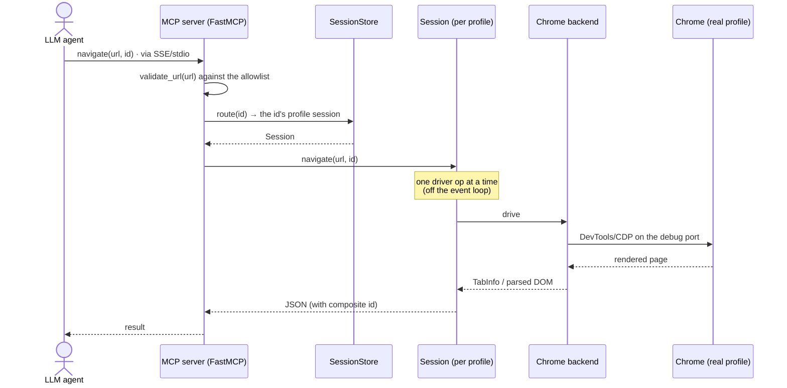

# browser-guard

**A safe, read-only MCP shell around a real Chrome browser.** It lets an LLM
agent *look at* and *navigate* the web through your own browser — reading pages,
querying the DOM, taking screenshots — without ever handing the agent the full,
unguarded power of a CDP or Playwright client. 

By default the agent can read and navigate, and nothing else. The one write
action that exists (`add_to_cart`) ships **disabled** and, even when enabled, can
only click an allowlisted button on an allowlisted site. That's what makes it
safe to point browser-guard at a Chrome profile you actually use.

## Disclaimer

browser-guard drives a **real, undetected** Chrome, so a site can't tell your
agent's visits from your own. That puts the responsibility on you: only point it
at sites whose Terms of Service permit automated access, and read those terms
first.

## Table of contents

- [Disclaimer](#disclaimer)
- [Why browser-guard](#why-browser-guard)
- [Quick start](#quick-start)
- [Tools](#tools)
- [Profiles](#profiles)
- [Safety: the allowlist](#safety-the-allowlist)
- [Technical design](#technical-design)
- [Installation reference](#installation-reference)
- [Development](#development)
- [Future work](#future-work)
- [License](#license)

## Why browser-guard

- **Read-only by default.** The agent gets a small, audited surface: list/open/
  close/select tabs, navigate, read the DOM, screenshot. There is exactly one
  write action, and it is disabled out of the box.
- **Safe on your real profile.** Because the agent *can't* take write actions on
  your browser, you can point browser-guard at your primary Chrome profile and
  let it reuse your existing logins — the agent can read your logged-in pages but
  cannot click "Buy", change settings, send mail, or delete anything.
- **Fully local.** It runs entirely on your machine and drives a Chrome on your
  machine. No cloud, no proxy — nothing about your browsing leaves the host.
- **One-click install.** A single setup script installs a background service and
  prints the exact config block to paste into your agent.
- **Customizable allowlist.** Navigation is gated per host, and the lone write
  action only fires on allowlisted buttons on allowlisted sites — both under a
  YAML config you control.

## Quick start

```bash
git clone https://github.com/nishantsny/browser-guard.git
cd browser-guard

# Creates a venv, installs browser-guard, starts the background (SSE) service,
# and prints the agent config to paste below.
python3 setup/onetime_setup.py
```

Then paste the printed block into your agent's MCP config (e.g. `~/.claude.json`):

```json
"mcpServers": {
  "browser-guard": {
    "type": "sse",
    "url": "http://127.0.0.1:22001/sse"
  }
}
```

Restart your agent and ask it to open a tab and read a page. See
[Installation reference](#installation-reference) for the stdio alternative and
all the setup options.

## Tools

browser-guard exposes twelve tools over a swappable `WebNavigatorBackend`
(Selenium + Chrome by default). Each tool that acts on a specific tab takes the
tab's `id` — the value returned by `new_blank_tab` / `list_tabs`. Pass it back
verbatim; it is globally unique and routes itself to the right profile.

| Tool | What it does |
| --- | --- |
| `list_tabs` | List every open tab across all profiles |
| `new_blank_tab` | Open a new tab (optionally in a chosen `profile_dir`) |
| `select_tab` | Focus a tab by `id` |
| `navigate` | Point a tab at a URL (gated by the allowlist) |
| `close_tab` | Close a tab by `id` |
| `get_element_by_id` | `document.getElementById`, server-side |
| `get_elements_by_class_name` | `document.getElementsByClassName`, server-side |
| `query_selector` | `document.querySelector`, server-side |
| `query_selector_all` | `document.querySelectorAll`, server-side (paginated) |
| `screenshot` | PNG of the tab's current viewport |
| `force_reload_tab` | Reload a tab and refresh its cached DOM |
| `add_to_cart` | **The only write action** — click an allowlisted "add to cart" button (disabled by default) |

The DOM-query tools read a **parsed snapshot** of the rendered (post-JavaScript)
page and return compact JSON nodes (`tag`, `id`, `classes`, `attributes`,
collapsed `text`, sizes), with long values truncated to keep responses small.
The snapshot is cached per tab and transparently refreshed when stale, so
repeated queries against the same page are cheap. Missing tabs and invalid
selectors come back as structured `{"error": …}` results, never exceptions.

## Profiles

A **profile** is one Chrome `--user-data-dir`: one browsing session with its own
cookies, storage, and logins. The crucial rule:

> **One profile = one Chrome window at a time.** A profile directory can be held
> by only a single Chrome process (it's guarded by Chrome's `SingletonLock`).

browser-guard keeps **one browser session per profile**, launched lazily on
first use. That has two consequences:

- **Different profiles run in parallel.** Give a request its own `profile_dir`
  and it gets an independent Chrome process — so separate profiles can be driven
  concurrently.
- **Within one profile, drive one tab at a time.** A single session has one
  focused window and requests are *not* serialized for you; fire calls in
  parallel against the same profile and they race over that shared window. Issue
  calls sequentially and wait for each to return.

**Which profile should I use?**

- **Let the agent create one** (or pass a fresh `profile_dir`) when you just want
  the agent to drive a browser. This is the normal, friction-free path.
- **Point it at your real Chrome profile** to reuse your existing logins. Since
  that profile can only be open in one window, browser-guard *becomes* that
  window: you can watch it, but you shouldn't also run your everyday Chrome on
  the same profile at the same time, and the window is there for the agent to
  drive — not for you to click around in.

If you omit `profile_dir`, requests use a shared default profile at
`~/.cache/browser-guard/chrome-profile`, so logins persist across restarts.

## Safety: the allowlist

Every URL passed to `navigate` / `new_blank_tab` is checked against a per-host
allowlist before Chrome is told to go there. The shipped default keeps **reads
wide open** and **every write action disabled**:

- **Navigation** is gated by `(host, path)` regexes under each host. Bare domains
  are normalized to `https://`, `www.` is stripped, and query strings/fragments
  pass through untouched. Anything not listed is rejected with a structured
  error.
- **The write action** (`add_to_cart`) is default-deny. Enabling it for a host
  requires both listing the host *and* the exact visible button label it may
  click — so it can never be steered into "Buy now", checkout, or an
  agent-targeted decoy control.

The config lives at `~/.browser_guard/allowlist.yaml` (installed by the setup
script; falls back to the repo sample at `configs/samples/allowlist.yaml`). It's
schema-checked on load — a malformed file fails startup with the offending field
named. Start narrow, add the URL shapes you actually need, and restart the
service.

## Technical design

The agent never touches Chrome directly. Every tool call crosses the same
audited path: the **MCP server** validates and routes it, a per-profile
**session** serializes it onto the **backend**, and only the backend speaks to
Chrome (over the DevTools protocol on a private debugging port). The agent only
ever sees the twelve tools and their JSON results.



Key points of the flow:

- **The MCP process** owns policy (URL allowlist, write-action gating) and the
  set of sessions. It resolves a request's `profile_dir` to a concrete path,
  builds a backend for it, and hands that to the session store.
- **The session store** keeps one **session** per profile and routes each tab
  `id` (a `<profile>-<handle>` composite) back to the session that owns it.
- **The session** is the async coordinator: it runs the synchronous, non-thread-
  safe Selenium backend off the event loop, one operation at a time, and manages
  the per-tab DOM cache and idle-tab cleanup.
- **The backend** is the only code that imports a browser library. It launches
  Chrome *itself* — a plain `google-chrome --user-data-dir=… --remote-debugging-
  port=…` subprocess — and *attaches* Selenium over the DevTools port. It
  deliberately avoids letting ChromeDriver spawn Chrome, because ChromeDriver
  injects automation switches (`--enable-automation`, `AutomationControlled`)
  that set `navigator.webdriver = true` and show the "controlled by automated
  software" banner. Launching Chrome ourselves keeps the window
  indistinguishable from an ordinary, human-run browser.

## Installation reference

### Background service over SSE (recommended)

Keeps the Chrome session warm across agent restarts.

```bash
git clone https://github.com/nishantsny/browser-guard.git
cd browser-guard
python3 setup/onetime_setup.py
```

The setup script creates a venv at `.venv` and installs browser-guard into it
(via `uv`, falling back to stdlib `venv` + `pip`), copies the sample allowlist to
`~/.browser_guard/allowlist.yaml` (never overwriting an existing one), writes a
**systemd user service** serving SSE on port **22001** pinned to that venv,
enables it, and prints the JSON block to add to your agent. It's idempotent.
Useful flags: `--port`, `--config-dir`, `--service-name` (stand up a second
instance without touching the first), `--venv` and `--python` (use your own
interpreter and skip venv creation), and `--display`.

### On-demand over stdio

For simple local use where the agent manages the process lifecycle. Add to your
agent's `mcpServers`:

```json
"browser-guard": {
  "command": "/path/to/browser-guard/.venv/bin/python",
  "args": ["-m", "browser_guard.mcp.server", "--allowlist", "/home/you/.browser_guard/allowlist.yaml"],
  "env": { "DISPLAY": ":0" }
}
```

`--allowlist` is optional (it falls back to `~/.browser_guard/allowlist.yaml`
then the repo sample). `DISPLAY` is only needed when launching headed Chrome
from a non-graphical parent process. Restart the agent to register the server.

## Development

Requirements: Python ≥ 3.11 and Google Chrome on the host. Runtime deps are
`mcp[cli]`, `selenium` (bundles Selenium Manager, so ChromeDriver auto-
downloads), `beautifulsoup4`, and `pyyaml`.

```bash
uv venv && uv pip install -e ".[dev]"
pytest test/unit/                    # never launches a browser
pytest test/e2e/                     # drives a real Chrome
BROWSER_GUARD_HEADLESS=1 pytest test/e2e/   # on a machine with no display
```

The e2e suite renders inline `data:` pages in a throwaway profile (no network,
no allowlisted host) and includes a harness that stands the real MCP server up
on an ephemeral port. The same suites run on every push/PR via the
[`e2e` workflow](.github/workflows/e2e.yml).

## Future work

- **Non-Chromium browsers** — extend the `WebNavigatorBackend` interface beyond
  Selenium/Chrome (e.g. Firefox) so the same guarded tool surface drives other
  engines.

## License

[Apache License 2.0](./LICENSE).
