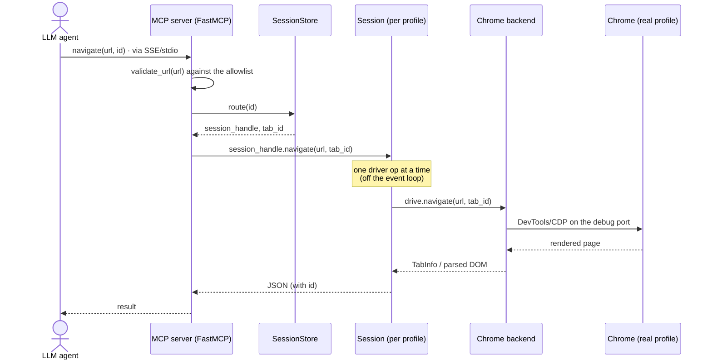

# browden

[](https://github.com/nishantsny/browden/actions/workflows/e2e.yml)
[](./LICENSE)
[](https://www.python.org/downloads/)
[](https://modelcontextprotocol.io)

**A local, cross-platform, read-only (configurable) MCP shell around a real Chrome browser.** It lets an LLM
agent *look at* and *navigate* the web through your own browser. The agent can read pages,
querying the DOM, take screenshots, but can never execute any write action. The MCP
is configurable to allow button-clicks and text-fill, allowlisted per website and visible element. 

_Short demo video: https://youtu.be/q-W3Z9nlj58_

## Disclaimer

`browden` drives a **real, undetected** Chrome, making the user eerily similar to a human. 

**With great power comes great responsibility**: only point this to sites whose Terms of Service permit automated access.


## When to use browden

browden is deliberately narrow: a **safe, local, undetected, read-only, with allowlisted writes**. 
This allows your agent to run wild on your *own* logged-in Chrome. Use browden for your daily research needs + a few writes. 
Defer to richer automation tools when you need to *drive* the browser rather than *read* it.

**Typical usecases:**

- Let an agent read and navigate your **logged-in** pages while it stays
  structurally unable to click "Buy", send mail, or delete anything.
- Put a **prompt-injection perimeter** around the agent — reads are allowlisted, so
  it can't be hijacked by a page it was never allowed to open.
- Run **fully local** — no cloud, no account, no API key; nothing about your
  browsing leaves the host.
- Drive the browser **like a human** (please see [disclaimer](#disclaimer)).

## When NOT to use browden
**Reach for something else when you need:**

| If you need… | Consider |
| --- | --- |
| Full write automation and agentic task loops | [browser-use/browser-use](https://github.com/browser-use/browser-use) |
| A complete Playwright tool surface over MCP (click, type, fill, upload) | [microsoft/playwright-mcp](https://github.com/microsoft/playwright-mcp) |
| Cloud browsers at scale, or natural-language act/extract/observe | [browserbase/mcp-server-browserbase](https://github.com/browserbase/mcp-server-browserbase) |

## Key Features

- **Read-only by default.** The agent gets a small, audited surface: list/open/
  close/select tabs, navigate, read the DOM, screenshot. All write actions must be allowlisted
  by each domain, each action and each element on which action is being taken.
- **A trusted-website perimeter for reads.** Even *reading* untrusted websites exposes your agent to
  a myriad of prompt-injections. The MCP **allowlists readable websites** using [Tranco top sites](https://tranco-list.eu/) and an overridable list.
- **Safe on your logged-in Chrome.** Because the agent *can't* take write actions on
  your browser, you can point browden at your primary Chrome profile and
  let it reuse your existing logins — the agent can read your logged-in pages but
  cannot click "Buy", change settings, send mail, or delete anything.
- **No data exfiltration, all local.** It runs entirely on your machine and drives a Chrome on your
  machine. No cloud, no proxy — nothing about your browsing leaves the host.
- **One-click install for Linux/Mac (minimal for Windows).** A single setup script installs a background service and
  prints the exact config block to paste into your agent.
- **Platform-agnostic.** The same setup script and tool surface run on Linux,
  macOS, and Windows, each using the OS's native service manager (systemd /
  launchd / Task Scheduler).

## Quick start

```bash
git clone https://github.com/nishantsny/browden.git
cd browden
python3 setup/onetime_setup.py
```

The setup script will print a MCP config (sample below), paste that into your agent's MCP config (e.g. `~/.claude.json`)

```json
"mcpServers": {
  "browden": {
    "command": "/path/to/browden/.venv/bin/python",
    "args": ["-m", "browden.mcp.server", "--allowlist", "/home/you/.browden/allowlist.yaml"],
    "env": { "DISPLAY": ":0" }
  }
}
```

For quick test, restart your agent and ask it to open a tab and read a page. 

If you prefer a persistent mcp process, use `setup/onetime_setup.py --mode service`, details in [Installation reference](#installation-reference).

## Dependencies

Requires **Python ≥ 3.11** and **Google Chrome** on the host. Setup is the same
clone-and-run on every OS; the notes below only cover what differs per platform.

### Linux

- Run the setup command with `python3`.
- Headed Chrome needs an X11 `DISPLAY` (the `env` block in the stdio config); on
  a machine with no display, set `BROWDEN_HEADLESS=1`.
- `--mode service` installs a **systemd user** unit.

### macOS

- Run the setup command with `python3`.
- Chrome is found at `/Applications/Google Chrome.app` (or `~/Applications`); no
  `DISPLAY` is needed.
- `--mode service` installs a **launchd** LaunchAgent.

### Windows

- Run in **PowerShell** (or Windows Terminal), and use `py -3` instead of
  `python3` — e.g. `py -3 setup\onetime_setup.py`. No administrator rights are
  needed.
- Chrome is found under `Program Files`.
- `--mode service` installs a **Task Scheduler** logon task.

## Tools

browden exposes tools over a swappable `WebNavigatorBackend`
(Selenium + Chrome by default). Each tool that acts on a specific tab takes the
tab's `id` — the value returned by `new_blank_tab` / `list_tabs`. Pass it back
verbatim; it is globally unique and routes itself to the right profile (multiple user profiles are supported).

| Tool | What it does |
| --- | --- |
| `list_tabs` | List every open tab across all profiles |
| `new_blank_tab` | Open a new tab (optionally in a chosen `profile_dir`) |
| `select_tab` | Focus a tab by `id` |
| `navigate` | Point a tab at a URL (gated by the read allowlist) |
| `close_tab` | Close a tab by `id` |
| `get_element_by_id` | `document.getElementById`, server-side |
| `get_elements_by_class_name` | `document.getElementsByClassName`, server-side |
| `query_selector` | `document.querySelector`, server-side |
| `query_selector_all` | `document.querySelectorAll`, server-side (paginated) |
| `screenshot` | PNG of the tab's current viewport |
| `force_reload_tab` | Reload a tab and refresh its cached DOM |
| `click` | **A write action, off by default** — click a control on a host listed in the `click` allowlist; each host declares a **required** `label` regex the control's visible text must fully match (`.*` to allow any). No host is listed out of the box. |
| `insert_text` | **A write action, off by default** — type text into a single visible, non-readonly text field (`<textarea>`, a text `<input>`, or a `contenteditable`) on a host listed in the separate `write-text` allowlist section; the field's visible label (placeholder / aria-label / associated `<label>`) must fully match that host's **required** `label` regex. |

## Profiles

A **profile** is equivalent to Chrome's `--user-data-dir`: one browsing session with its own
cookies, storage, and logins. The crucial rule:

> **One profile = one Chrome window at a time.** A profile directory can be held
> by only a single Chrome process (it's guarded by Chrome's `SingletonLock`).

browden keeps **one browser session per profile**, launched lazily on
first use. That has two consequences:

- **Different profiles run in parallel.** Give a request its own `profile_dir`
  and it gets an independent Chrome process — so separate profiles can be driven
  concurrently.
- **Within one profile, the agent can drive only one tab at a time.** A single session has one
  focused window and requests are *not* serialized for you; fire calls in
  parallel against the same profile and they race over that shared window. Issue
  calls sequentially and wait for each to return.

**Which profile should I use?**

- **Let the agent create one** (or pass a fresh `profile_dir`) when you just want
  the agent to drive a browser. This is the normal, friction-free path. 
  The profile is persisted, so login will persist across restarts.
- **Point it at your real Chrome profile** to reuse your existing logins. Since
  that profile can only be open in one window, browden *becomes* that
  window: you can watch it, but you shouldn't also run your everyday Chrome on
  the same profile at the same time, and the window is there for the agent to
  drive — not for you to click around in.

## Safety: the allowlist

Every URL is checked before Chrome is told to go there. Merely *navigating* to a
hostile page is risky. Each page's content is fed to the LLM and can lead to prompt injection. 
The "allowlist" policy has **three layers**, evaluated in order (first match wins):

1. **denylist** — host/path rules that are **always refused**, before anything
   else. Wins over the allowlist below, even when reads are disabled. Empty by
   default.
2. **read allowlist** — a URL may be read/navigated only if it is allowed by:
   - **website_overrides** — explicit `(host, path)` regexes (host `*` = any host).
     An override for a host **triumphs over Tranco**: once a host is listed here,
     its rule alone decides — so you can allow a host Tranco doesn't rank, *or*
     path-scope (or effectively block) one Tranco would otherwise wave through
     (`reddit.com: ["^/r/pics/"]`). Setting `"*": [".*"]` re-opens the whole web.
   - **Tranco top-sites** — for any host *without* an override, a local, offline
     snapshot of the top ~500k most-visited domains (fetched next to your
     allowlist by setup, not committed). A listed domain covers its
     subdomains (`google.com` ⇒ `mail.google.com`) but not lookalikes
     (`google.com.evil.co`). The cutoff (`top_n`) is configurable, and the whole
     read allowlist can be switched off (`read.enabled: false`) for a trusted
     throwaway profile. **Popularity is a proxy for _established_, never a
     guarantee of _safe_** — reputable sites host untrusted content too, so this
     shrinks attack surface rather than removing it.

   Navigation also re-checks the URL the browser *lands* on after any redirect,
   so an open redirect on an allowlisted site (or a server-side 302) can't
   silently park the tab off-allowlist — an off-list landing resets the tab to
   `about:blank`.
3. **write actions** — `click` and `insert_text` are both default-deny, each
   gated by its **own** allowlist section (`click` and `write-text`), so
   permitting typing never implies permitting clicks, or the reverse. Each action
   needs to be enable on each domain. On each domain, the allowlist mandates a `label` regex, 
   which should match the control's user visible text (for `click`) or the field's user visible label (for `insert_text`).
   Any control can be explicitly enabled via `label: '.*'`. The
   denylist vetoes both too; page-injected agent-targeted decoys are always
   refused regardless of the label.

To refresh the Tranco snapshot, use `python3 setup/fetch_tranco.py` and restart the MCP server.

### Sample allowlists
- [`configs/samples/read_only_on_popular_websites.yaml`](configs/samples/read_only_on_popular_websites.yaml)).
- [`allow_grocery_cart_manipulation.yaml`](configs/samples/allow_grocery_cart_manipulation.yaml)
- [`configs/samples/allowlist-read-deny.yaml`](configs/samples/allowlist-read-deny.yaml);


## Technical design

The agent never touches Chrome directly. Every tool call crosses the same
audited path: the **MCP server** validates and routes it, a per-profile
**session** serializes it onto the **backend**, and only the backend speaks to
Chrome (over the DevTools protocol on a private debugging port). The agent only
ever sees the tools and their JSON results.



Key points of the flow:

- **The MCP process** owns policy (URL allowlist, write-action gating) and the
  set of sessions. It resolves a request's `profile_dir` to a concrete path,
  builds a backend for it, and hands that to the session store.
- **The session store** keeps one **session** per profile and routes each tab
  `id` (a `<profile>-<handle>` composite) back to the session that owns it.
- **The session** is the async coordinator: it runs the synchronous, non-thread-
  safe Selenium backend off the event loop, one operation at a time, and manages
  the per-tab DOM cache and idle-tab cleanup.
- **The backend** is the only code that imports a browser library. It launches
  Chrome *itself* — a plain `google-chrome --user-data-dir=… --remote-debugging-
  port=…` subprocess — and *attaches* Selenium over the DevTools port. It
  deliberately avoids letting ChromeDriver spawn Chrome, because ChromeDriver
  injects automation switches (`--enable-automation`, `AutomationControlled`)
  that set `navigator.webdriver = true` and show the "controlled by automated
  software" banner. Launching Chrome ourselves keeps the window
  indistinguishable from an ordinary, human-run browser.

## Installation reference

`python3 setup/onetime_setup.py` creates a venv at `.venv` and installs browden
into it (via `uv`, falling back to stdlib `venv` + `pip`), copies the sample
allowlist to `~/.browden/allowlist.yaml` (never overwriting an existing one),
fetches the Tranco snapshot next to it, and prints the JSON block to add to your
agent. It's idempotent, and **defaults to stdio** (shown in
[Quick start](#quick-start)) — pass `--mode service` for the persistent SSE
service below.

Useful flags: `--mode` (`stdio` default, or `service`), `--config-dir`, `--venv`
and `--python` (use your own interpreter and skip venv creation), `--display`,
and — for service mode — `--port` and `--service-name` (stand up a second
instance without touching the first).

### Background service over SSE

Runs browden as a background service via the host's **native service manager** —
systemd (Linux), launchd (macOS), or Task Scheduler (Windows) — so the Chrome
session stays warm across agent restarts, serving SSE on port **22001** pinned to
the venv.

```bash
git clone https://github.com/nishantsny/browden.git
cd browden
python3 setup/onetime_setup.py --mode service
```

The same command works on all three platforms — each writes its native
service description:

| OS | Service manager | What gets written |
| --- | --- | --- |
| Linux | systemd (user) | `~/.config/systemd/user/<name>.service` |
| macOS | launchd | `~/Library/LaunchAgents/<name>.plist` |
| Windows | Task Scheduler | a logon-triggered task running a windowless launcher |

(Chrome is located on `PATH`, then at the OS's canonical install location — macOS
`/Applications`, Windows `Program Files`; point `BROWDEN_CHROME_BINARY` at it if
it lives elsewhere.)

Then paste the printed block into your agent's MCP config:

```json
"mcpServers": {
  "browden": {
    "type": "sse",
    "url": "http://127.0.0.1:22001/sse"
  }
}
```

<details>
<summary><b>Refreshing the allowlisted domains</b></summary>

The Tranco top-sites list the read allowlist uses is an offline snapshot fetched
into your config dir next to `allowlist.yaml` (not committed), so it doesn't
update on its own. Refresh it, then restart the service to load the new list:

```bash
python3 setup/fetch_tranco.py                    # re-download the top-500k snapshot
systemctl --user restart browden.service   # reload it into the running server
```

`fetch_tranco.py` writes the snapshot into your config dir (`~/.browden` by
default) — the very file the server reads — so the restart is all it takes to load
the new list. Pass `--top-n N` to keep a different number of domains, `--config-dir`
if you installed elsewhere, and use your own `--service-name` in the restart if you
installed under one. (If you instead
did a non-editable install, point `--out` at that copy, or reinstall.) On the
default stdio setup there's no service to restart — just restart your agent, which
relaunches the server on its next call.

</details>

<details>
<summary><b>stdio config notes</b> — allowlist fallback &amp; DISPLAY</summary>

stdio is the default the [Quick start](#quick-start) sets up; the block it prints
looks like:

```json
"browden": {
  "command": "/path/to/browden/.venv/bin/python",
  "args": ["-m", "browden.mcp.server", "--allowlist", "/home/you/.browden/allowlist.yaml"],
  "env": { "DISPLAY": ":0" }
}
```

`--allowlist` is optional (it falls back to `~/.browden/allowlist.yaml`
then the repo sample). `DISPLAY` is only needed when launching headed Chrome
from a non-graphical parent process. Restart the agent to register the server.

</details>

## Development

Requirements: Python ≥ 3.11 and Google Chrome on the host. Runtime deps are
`mcp[cli]`, `selenium` (bundles Selenium Manager, so ChromeDriver auto-
downloads), `beautifulsoup4`, and `pyyaml`.

```bash
uv venv && uv pip install -e ".[dev]"
pytest test/unit/                    # never launches a browser
pytest test/e2e/                     # drives a real Chrome
BROWDEN_HEADLESS=1 pytest test/e2e/   # on a machine with no display
```

The e2e suite renders inline `data:` pages in a throwaway profile (no network,
no allowlisted host) and includes a harness that stands the real MCP server up
on an ephemeral port. The same suites run on every push/PR via the
[`e2e` workflow](.github/workflows/e2e.yml).

## Future work

- **Non-Chromium browsers** — extend the `WebNavigatorBackend` interface beyond
  Selenium/Chrome (e.g. Firefox) so the same guarded tool surface drives other
  engines.
- **Expose debugging APIs** — surface read-only console, network, and performance
  signals (browser logs, request/response metadata) so an agent can inspect a page,
  not just read its DOM.
- **Expose more write actions** — grow the gated write surface beyond `click`
  and `insert_text` (e.g. select/checkbox, file upload), each held to the same
  allowlist-and-label policy.

All feedback is welcome — please [open an issue](https://github.com/nishantsny/browden/issues).

## Attribution

The read allowlist's default top-sites list is the **Tranco** ranking — fetched
at setup time, **not** redistributed in this repo:

> V. Le Pochat, T. Van Goethem, S. Tajalizadehkhoob, M. Korczyński, W. Joosen.
> *Tranco: A Research-Oriented Top Sites Ranking Hardened Against Manipulation.*
> NDSS 2019. <https://tranco-list.eu>

Tranco aggregates several upstream rankings whose licenses govern the resulting
data — notably **Majestic** (CC BY 3.0) and **Chrome UX Report** (CC BY-SA 4.0),
which require attribution, and **Cloudflare Radar** (CC BY-**NC** 4.0), which is
**non-commercial**. Because the default combined list may include the NC/SA
sources, if you intend **commercial** use, generate a list restricted to
permissively-licensed sources at <https://tranco-list.eu/configure> and pin its
permanent list ID via `fetch_tranco.py --url <permalink>` — which also makes your
allowlist reproducible. This is attribution guidance, not legal advice.

## License

[Apache License 2.0](./LICENSE) — a permissive license with an explicit patent
grant. You can use, modify, and redistribute browden, including in proprietary
products, provided you preserve the license and attribution notices. This
governs browden's code; the Tranco data carries its own terms (see
[Attribution](#attribution)).
