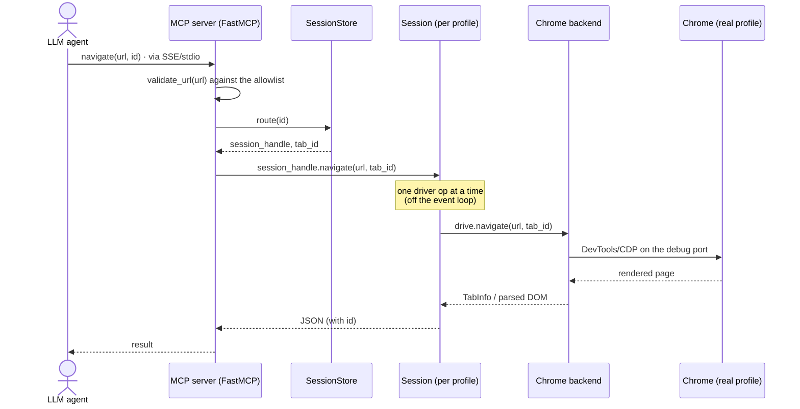

# safe-agent-browser

[](https://github.com/nishantsny/safe-agent-browser/actions/workflows/e2e.yml)
[](./LICENSE)
[](https://www.python.org/downloads/)
[](https://modelcontextprotocol.io)

**A local, cross-platform, read-only (configurable) MCP shell around a real Chrome browser.** It lets an LLM
agent *look at* and *navigate* the web through your own browser. The agent can read pages,
query the DOM, and take screenshots, but can never execute any write action. The MCP
is configurable to allow button-clicks and text-fill, allowlisted per website and visible element.

_Short demo video: https://youtu.be/q-W3Z9nlj58_

## Disclaimer

**With great power comes great responsibility**: Only point this MCP to sites whose Terms of Service permit automated access.

## When to use safe-agent-browser

safe-agent-browser is deliberately narrow: **safe, local, undetected, and read-only, with allowlisted writes**. 
This allows your agent to run wild on your *own* logged-in Chrome. Use safe-agent-browser for your daily research needs + a few writes. 
Defer to richer automation tools when you need to *drive* the browser rather than *read* it.

**Typical usecases:**

- Let an agent read and navigate your **logged-in** pages while it stays
  structurally unable to click "Buy", send mail, or delete anything.
- You need a **prompt-injection perimeter** around the agent.

## When NOT to use safe-agent-browser

| If you need… | Consider |
| --- | --- |
| Full write automation and agentic task loops | [browser-use/browser-use](https://github.com/browser-use/browser-use) |
| A complete Playwright tool surface over MCP (click, type, fill, upload) | [microsoft/playwright-mcp](https://github.com/microsoft/playwright-mcp) |
| Cloud browsers at scale, or natural-language act/extract/observe | [browserbase/mcp-server-browserbase](https://github.com/browserbase/mcp-server-browserbase) |

## Key Features

- **Read-only by default.** The agent gets a small, audited surface: list/open/
  close/select tabs, navigate, read the DOM, screenshot. All write actions must be allowlisted
  by each domain, each action and each element on which action is being taken.
- **A trusted-website perimeter for reads.** Even *reading* untrusted websites exposes your agent to
  a myriad of prompt-injections. The MCP **allowlists readable websites** using [Tranco top sites](https://tranco-list.eu/) and an overridable list.
- **Safe on your logged-in Chrome.** Because the agent *can't* take write actions on
  your browser, you can point safe-agent-browser at your primary Chrome profile and
  let it reuse your existing logins — the agent can read your logged-in pages but
  cannot click "Buy", change settings, send mail, or delete anything.
- **Rules can be scoped per browser profile.** The credentialed profile stays
  narrow while a scratch profile browses freely — widening one never widens the
  other. See [Scoping rules to a profile](#scoping-rules-to-a-profile).
- **No data exfiltration, all local.** It runs entirely on your machine and drives a Chrome on your
  machine. No cloud, no proxy — nothing about your browsing leaves the host.
- **One-click install for Linux/Mac (minimal for Windows).** A single setup script installs a background service and
  prints the exact config block to paste into your agent.
- **Platform-agnostic.** The same setup script and tool surface run on Linux,
  macOS, and Windows, each using the OS's native service manager (systemd /
  launchd / Task Scheduler).
- **Modest resource usage.** The server process holds to ~150 MB — see [perf_benchmark](perf_benchmark/).

## Quick start

```bash
git clone --branch stable https://github.com/nishantsny/safe-agent-browser.git
cd safe-agent-browser
python3 setup/onetime_setup.py
```

> `--branch stable` installs the **latest release** — the `stable` channel only ever
> advances to tagged releases, never mid-flight `main`. To track development instead,
> clone without `--branch stable` (that follows `main`). To update later:
> `git -C safe-agent-browser pull --ff-only`.

The setup script will print a MCP config (sample below), paste that into your agent's MCP config (e.g. `~/.claude.json`)

```json
"mcpServers": {
  "safe-agent-browser": {
    "command": "/path/to/safe-agent-browser/.venv/bin/python",
    "args": ["-m", "safe_agent_browser.mcp.server", "--allowlist", "/home/you/.safe-agent-browser/allowlist.yaml"],
    "env": { "DISPLAY": ":0" }
  }
}
```

For quick test, restart your agent and ask it to open a tab and read a page. 

If you prefer a persistent mcp process, use `setup/onetime_setup.py --mode service`, details in [Installation reference](#installation-reference).

## Dependencies

Requires **Python ≥ 3.11** and **Google Chrome** on the host. Setup is the same
clone-and-run on every OS; the notes below only cover what differs per platform.

### Linux

- Run the setup command with `python3`.
- Headed Chrome needs an X11 `DISPLAY` (the `env` block in the stdio config); on
  a machine with no display, set `SAFE_AGENT_BROWSER_HEADLESS=1`.
- `--mode service` installs a **systemd user** unit.

### macOS

- Run the setup command with `python3`.
- Chrome is found at `/Applications/Google Chrome.app` (or `~/Applications`); no
  `DISPLAY` is needed.
- `--mode service` installs a **launchd** LaunchAgent.

### Windows

- Run in **PowerShell** (or Windows Terminal), and use `py -3` instead of
  `python3` — e.g. `py -3 setup\onetime_setup.py`. No administrator rights are
  needed.
- Chrome is found under `Program Files`.
- `--mode service` installs a **Task Scheduler** logon task.

## Tools

safe-agent-browser exposes tools over a swappable `WebNavigatorBackend`
(Selenium + Chrome by default). Each tool that acts on a specific tab takes the
tab's `id` — the value returned by `new_blank_tab` / `list_tabs`. Pass it back
verbatim; it is globally unique and routes itself to the right profile (multiple user profiles are supported).

| Tool | What it does |
| --- | --- |
| `list_tabs` | List every open tab across all profiles |
| `new_blank_tab` | Open a new tab (optionally in a chosen `profile_dir`) |
| `select_tab` | Focus a tab by `id` |
| `navigate` | Point a tab at a URL (gated by the read allowlist) |
| `close_tab` | Close a tab by `id` |
| `get_element_by_id` | `document.getElementById`, server-side |
| `get_elements_by_class_name` | `document.getElementsByClassName`, server-side |
| `query_selector` | `document.querySelector`, server-side |
| `query_selector_all` | `document.querySelectorAll`, server-side (paginated) |
| `screenshot` | PNG of the tab's current viewport |
| `invalidate_dom_cache` | Drop a tab's cached DOM so the next read re-fetches the live HTML (no page load — JS-built state survives) |
| `force_reload_tab` | Reload a tab and refresh its cached DOM |
| `switch_to_frame` | Focus a tab on the `<iframe>` matched by a CSS selector, so the DOM-read tools and `screenshot` see the frame's contents instead of the top page. **Same-origin frames only** (the exact origin: scheme, host and port): the frame's `src` must be readable before the switch, and the landed document must be readable **and** same-origin with the top page after it, or the focus goes back to where it was. A frame the page wrote itself (`srcdoc`, or an `about:blank` frame filled in by script) is judged by the page that wrote it. |
| `switch_to_parent_frame` | Move a tab's focus up one frame level. The landed frame is checked again (readable and same-origin), since it may have navigated while focus was deeper; if it fails, the tab goes back to its top document. |
| `switch_to_default_content` | Return a tab's focus to its top document, checking that the top page is still readable. |
| `click` | **A write action, off by default** — click a control on a host listed in the `click` allowlist; each host declares a **required** `label` regex the control's visible text must fully match (`.*` to allow any). No host is listed out of the box. |
| `insert_text` | **A write action, off by default** — type text into a single visible, non-readonly text field (`<textarea>`, a text `<input>`, or a `contenteditable`) on a host listed in the separate `write-text` allowlist section; the field's visible label (placeholder / aria-label / associated `<label>`) must fully match that host's **required** `label` regex. |
| `upload_file` | **A write action, off by default** — attach a local file to a single visible, non-readonly `<input type=file>` on a host listed in the separate `upload-file` allowlist section. Additionally gated by `allowed_upload_locations`: the file must resolve to a regular file under a directory you listed, so an upload can never become an arbitrary local-file read. No host and no root are listed out of the box. |

Frame focus sticks to the tab until you move it or the tab navigates or
reloads. Every later call re-enters the frame only while it is still the one
admitted: the top page hasn't moved and the frame still holds a document of the
origin it had on entry. While a tab is inside a frame, every read and write
tool is judged by the frame's own URL, not the top page's. Writes work there
too (`click`, `insert_text`, `press_key`), each under its own rules for the
frame's URL; a frame the page wrote itself (`srcdoc`) has its parent page's
URL, so the parent's rules apply. A `screenshot` inside a frame also needs the
top page to be readable, since the capture shows it. If the frame's URL can't
be read, the frame has been removed or changed, or a read's expired snapshot
made safe-agent-browser reload the page (which returns the tab to its top document), the
call is refused rather than answered from the top page. The tab is then at its
top document: call `switch_to_frame` again.

### Reading the DOM

The four read tools return *serialized nodes*, and every one of them truncates:
`text` is capped at **2000 chars** unconditionally — `limit` / `offset` paginate
matched *elements*, never the content of one element — attribute values at 256
chars, and `html` is opt-in behind `include_html`. `max_html_bytes` caps `html`
alone and does nothing unless `include_html=True`.

So to pull a large payload out of a page — a JSON endpoint rendered in Chrome's
`<pre>`, a long article body — ask for the HTML and raise its cap:

```jsonc
query_selector("pre", id=tab, max_html_bytes=5000000)
→ {"text_length": 698676, "text_truncated": true, "text": "…2000 chars…"}   // ✗ include_html defaults to false

query_selector("pre", id=tab, include_html=true, max_html_bytes=5000000)
→ {"html_truncated": false, "html": "<pre>…698 KB…</pre>"}                  // ✓
```

Check `html_truncated == false` rather than trusting the returned length: the cap
cuts UTF-8 bytes and decodes with `errors="ignore"`, so a truncated `html` ends
silently. **[docs/dom-reads.md](./docs/dom-reads.md)** documents every cap and
every field of a returned node.

## Profiles

A **profile** is equivalent to Chrome's `--user-data-dir`: one browsing session with its own
cookies, storage, and logins. The crucial rule:

> **One profile = one Chrome window at a time.** A profile directory can be held
> by only a single Chrome process (it's guarded by Chrome's `SingletonLock`).

safe-agent-browser keeps **one browser session per profile**, launched lazily on
first use. That has two consequences:

- **Different profiles run in parallel.** Give a request its own `profile_dir`
  and it gets an independent Chrome process — so separate profiles can be driven
  concurrently.
- **Within one profile, the agent drives one tab at a time — but concurrent
  requests are safe.** A single session has one focused window, so safe-agent-browser
  serializes every request to that profile behind a per-session lock: each one
  waits its turn, then re-selects its own tab before acting, so a burst of
  parallel calls to ten tabs returns ten correct answers instead of racing over
  the shared window. Concurrency here buys safety, not speed — the calls still
  run one after another. For genuine parallelism, use separate profiles. A
  request that waits more than **10s** for its turn gives up and returns
  `{"error": "browser session busy — ...", "id": ...}`; it's safe to retry.

Because a profile is a real security boundary, the allowlist can scope rules to
one: see [Scoping rules to a profile](#scoping-rules-to-a-profile) for keeping
the credentialed profile narrow while a scratch profile browses freely.

**Which profile should I use?**

- **Let the agent create one** (or pass a fresh `profile_dir`) when you just want
  the agent to drive a browser. This is the normal, friction-free path. 
  The profile is persisted, so login will persist across restarts.
- **Point it at your real Chrome profile** to reuse your existing logins. Since
  that profile can only be open in one window, safe-agent-browser *becomes* that
  window: you can watch it, but you shouldn't also run your everyday Chrome on
  the same profile at the same time, and the window is there for the agent to
  drive — not for you to click around in. Note that the read perimeter is
  enforced on the whole window: a tab parked on a site outside the read
  allowlist is **closed** when the agent lists tabs (so it can neither read it
  nor learn it exists) — don't keep tabs you care about open in a
  safe-agent-browser-driven window.

## Safety: the allowlist

Every URL is checked before Chrome is told to go there. Merely *navigating* to a
hostile page is risky. Each page's content is fed to the LLM and can lead to prompt injection. 
The "allowlist" policy has **four layers**. The first three are evaluated in order
(first match wins); the fourth bounds `upload_file` alone, and is additional to — never
a substitute for — the third:

1. **denylist** — host/path rules that are **always refused**, before anything
   else. Wins over the allowlist below, even when reads are disabled. Empty by
   default.
2. **read allowlist** — a URL may be read/navigated only if it is allowed by:
   - **website_overrides** — explicit `(host, path)` regexes (host `*` = any host).
     An override for a host **triumphs over Tranco**: once a host is listed here,
     its rule alone decides — so you can allow a host Tranco doesn't rank, *or*
     path-scope (or effectively block) one Tranco would otherwise wave through
     (`reddit.com: ["^/r/pics/"]`). Setting `"*": [".*"]` re-opens the whole web.
   - **Tranco top-sites** — for any host *without* an override, a local, offline
     snapshot of the top ~1m most-visited domains (fetched next to your
     allowlist by setup, not committed). A listed domain covers its
     subdomains (`google.com` ⇒ `mail.google.com`) but not lookalikes
     (`google.com.evil.co`). The cutoff (`top_n`) is configurable, and the whole
     read allowlist can be switched off (`read.enabled: false`) for a trusted
     throwaway profile. **Popularity is a proxy for _established_, never a
     guarantee of _safe_** — reputable sites host untrusted content too, so this
     shrinks attack surface rather than removing it.
   - **scheme** — orthogonal to host: only `https` is accepted, so `file://` /
     `ftp://` / `data:` can never reach Chrome even on a permissive host rule. A
     non-https scheme is allowed only for a host you name **explicitly** in
     `website_overrides` — e.g. `localhost: [".*"]` re-enables `http://localhost`,
     and `"": ["^/home/me/.*"]` re-enables `file://` under that path. A blanket
     `"*": [".*"]` opens the web for https but does **not** silently re-enable
     non-https everywhere.

   Navigation also re-checks the URL the browser *lands* on after any redirect,
   so an open redirect on an allowlisted site (or a server-side 302) can't
   silently park the tab off-allowlist — an off-list landing resets the tab to
   `about:blank`.
3. **write actions** — `click`, `insert_text`, `press_key` and `upload_file` are
   all default-deny, each gated by its **own** allowlist section (`click`,
   `write-text`, `press-key`, `upload-file`), so permitting typing never implies
   permitting clicks, or the reverse. Each action
   must be enabled per domain. On each domain, the allowlist mandates a `label` regex, 
   which must match the control's user-visible text (for `click`) or the field's user-visible label (for `insert_text`).
   Any control can be explicitly enabled via `label: '.*'`. The
   denylist vetoes both too; page-injected agent-targeted decoys are always
   refused regardless of the label.
4. **allowed upload locations** — a fourth layer that exists for `upload_file` alone, because
   that action is the one that reads **your filesystem** and sends the bytes to a
   website. `allowed_upload_locations` lists the directories a file may be taken from, and is
   required: with none configured nothing is uploadable, including in an
   `allow_all` profile. It is deliberately not per-host — it bounds what may
   leave the machine at all, independently of where it is going. A path is
   expanded and fully resolved before it is compared, so neither `../` nor a
   symlink planted inside one reaches outside it. The resolved path is what the
   browser is handed, so the file that was checked is the file that is sent.


To refresh the Tranco snapshot, use `python3 setup/fetch_tranco.py` and restart the MCP server.

### Scoping rules to a profile

All three layers can be scoped to a single **[profile](#profiles)** — the Chrome
`--user-data-dir` that holds one browsing identity's cookies, extensions and
logins. Without that, loosening a rule for one kind of work loosens it for the
browser holding your real sessions too.

A `profiles:` block takes the *same* rule vocabulary, keyed by profile directory:

```yaml
denylist:                                   # global: the floor every profile gets
  "*": ['^/(account|settings)/security.*']
read:
  tranco: {enabled: true, top_n: 1000000}

profiles:
  ~/.cache/safe-agent-browser/chrome-profile:          # the credentialed profile: narrow
    click:
      secure.splitwise.com:
        - path: ['^/expenses.*']
          label: 'Save'

  ~/.cache/safe-agent-browser/chrome-research:         # a scratch profile: everything, here
    allow_all: true
```

- **A profile's rules are additive over the global ones.** A profile with no
  entry gets exactly the global rules — so a config written before this existed
  behaves identically — and widening one profile never widens another.
- **The denylist is unioned and still wins**, global entry or profile entry.
- **`read` settings are inherited** unless the profile restates them, so a
  profile can move `top_n` (or drop the popularity net *for itself*) without
  repeating the rest.
- **Keys are canonicalized** the way a caller's `profile_dir` is, so
  `~/.cache/safe-agent-browser/p` and its resolved path are one profile. A *relative* key
  is refused at load — it would depend on the server's working directory. A
  profile directory that doesn't exist yet is fine; Chrome creates it on first
  launch.
- **`infra` stays global** (one process, one set of caps) and is rejected inside
  a profile block rather than silently ignored.
- Edits hot-reload like every other rule, including for profiles already driving
  a live Chrome.

**`allow_all: true`** is the shorthand for "this is a scratch profile: let the
agent work in it" — every write action on every page, and every read of a host
the read gate would otherwise *rank*. Two things it deliberately keeps:

- **The Tranco net stays on** (turned on for that profile even if the global
  config had it off). Broad browsing across established sites is the low-risk
  case that motivates the flag; an unranked host — a typosquat, a domain
  registered yesterday, a paste site reached from a search page — still takes a
  deliberate act: `read: {tranco: {enabled: false}}` in the same block, or a
  named override.
- **The scheme gate is unmoved.** `file://` and plaintext `http://` are admitted
  only for a host named *explicitly* in `website_overrides`, which `allow_all`
  never does.

The denylist still vetoes everything under it, and `allow_all` is only valid
inside a profile — it describes one browsing identity, never all of them.

### Protecting safe-agent-browser's own files

The policy only holds if the agent can't rewrite it. That means the allowlist,
the Tranco/PSL snapshots next to it, *and* safe-agent-browser's source — an agent that edits
any of them widens its own access. Setup prints both steps at the end:

1. **Deny agent edits to every safe-agent-browser file** (`~/.safe-agent-browser/**` and the install
   tree) in your agent's settings — `"ask"` if you'd rather approve each edit,
   never auto-approve.
2. **Lock them down at the OS level.** Permission rules only gate the agent's
   *file* tools; any shell it runs (`Bash`, `python -c`, `sed -i`) writes to them
   directly, and command rules are trivially rephrased around. Make the files
   root-owned and read-only instead — safe-agent-browser only ever reads them:

   ```bash
   sudo chown -R root:root ~/.safe-agent-browser
   sudo find ~/.safe-agent-browser -type d -exec chmod 755 {} +   # +x = traverse, keep it
   sudo find ~/.safe-agent-browser -type f -exec chmod 444 {} +   # data, never executable
   ```

   Afterwards, refreshing the snapshots takes `sudo`.

### Sample allowlists
- [`read_only_on_popular_websites.yaml`](configs/samples/read_only_on_popular_websites.yaml) — the shipped default: Tranco reads, no writes.
- [`allow_grocery_cart_manipulation.yaml`](configs/samples/allow_grocery_cart_manipulation.yaml) — a worked example enabling `click`/`write-text` on a few storefronts.
- [`allow_label_activation.yaml`](configs/samples/allow_label_activation.yaml) — `click` a `<label>` to drive a radio/checkbox the page hid in CSS, authorized by the label's own visible text.
- [`allowlist-read-deny.yaml`](configs/samples/allowlist-read-deny.yaml) — a fully-commented tour of the read/deny system.
- [`profile_scoped_rules.yaml`](configs/samples/profile_scoped_rules.yaml) — scope rules per browser profile: a narrow credentialed profile, an `allow_all` scratch profile, a dev-server profile.
- [`allow_iframe_access.yaml`](configs/samples/allow_iframe_access.yaml) — read and act inside same-origin `<iframe>`s: frames are judged by their own URL under the usual read and write rules, and cross-origin frames stay refused however readable.
- [`allow_receipt_upload.yaml`](configs/samples/allow_receipt_upload.yaml) — enable `upload-file`: attach a local receipt to a Splitwise expense, bounded by `allowed_upload_locations`.
- [`allow_local_file_reads.yaml`](configs/samples/allow_local_file_reads.yaml) — opt `file://` local-file reads in (scoped by path).
- [`allow_localhost_dev_server.yaml`](configs/samples/allow_localhost_dev_server.yaml) — read a local `http://localhost:PORT` dev server.


## Technical design

The agent never touches Chrome directly. Every tool call crosses the same
audited path: the **MCP server** validates and routes it, a per-profile
**session** serializes it onto the **backend**, and only the backend speaks to
Chrome (over the DevTools protocol on a private debugging port). The agent only
ever sees the tools and their JSON results.


```mermaid
sequenceDiagram
    actor Agent as LLM agent
    participant MCP as MCP server (FastMCP)
    participant Store as SessionStore
    participant Session as Session (per profile)
    participant Backend as Chrome backend
    participant Chrome as Chrome (real profile)

    Agent->>MCP: navigate(url, id)  · via SSE/stdio
    MCP->>MCP: validate_url(url) against the allowlist
    MCP->>Store: route(id)
    Store-->>MCP: session_handle, tab_id
    MCP->>Session: session_handle.navigate(url, tab_id)
    Note over Session: one driver op at a time<br/>(off the event loop)
    Session->>Backend: drive.navigate(url, tab_id)
    Backend->>Chrome: DevTools/CDP on the debug port
    Chrome-->>Backend: rendered page
    Backend-->>Session: TabInfo / parsed DOM
    Session-->>MCP: JSON (with id)
    MCP-->>Agent: result
```

Key points of the flow:

- **The MCP process** owns policy (URL allowlist, write-action gating) and the
  set of sessions. It resolves a request's `profile_dir` to a concrete path,
  builds a backend for it, and hands that to the session store.
- **The session store** keeps one **session** per profile and routes each tab
  `id` (a `<profile>-<handle>` composite) back to the session that owns it.
- **The session** is the async coordinator: it runs the synchronous, non-thread-
  safe Selenium backend off the event loop, one operation at a time, and manages
  the per-tab DOM cache and idle-tab cleanup. Cleanup is a background pass on a
  timer (`infra.reap_interval_seconds`, 2h by default) — never work done on a
  tool call — that closes tabs the agent hasn't touched in an hour and forgets
  tabs the human closed in the browser. A tab is therefore closed between 1h and
  1h + one interval after its last use; only *agent* activity counts as use.
- **The backend** is the only code that imports a browser library. It launches
  Chrome *itself* — a plain `google-chrome --user-data-dir=… --remote-debugging-
  port=…` subprocess — and *attaches* Selenium over the DevTools port. It
  deliberately avoids letting ChromeDriver spawn Chrome, because ChromeDriver
  injects automation switches (`--enable-automation`, `AutomationControlled`)
  that set `navigator.webdriver = true` and show the "controlled by automated
  software" banner. Launching Chrome ourselves keeps the window
  indistinguishable from an ordinary, human-run browser.

## Installation reference

`python3 setup/onetime_setup.py` creates a venv at `.venv` and installs safe-agent-browser
into it (via `uv sync --frozen`, pinned by the committed `uv.lock`; falls back
to stdlib `venv` + `pip` when uv is absent), copies the sample
allowlist to `~/.safe-agent-browser/allowlist.yaml` (never overwriting an existing one),
fetches the Tranco snapshot next to it, and prints the JSON block to add to your
agent plus the hardening steps in
[Protecting safe-agent-browser's own files](#protecting-safe-agent-browsers-own-files). It's
idempotent, and **defaults to stdio** (shown in
[Quick start](#quick-start)) — pass `--mode service` for the persistent SSE
service below.

Useful flags: `--mode` (`stdio` default, or `service`), `--config-dir`, `--venv`
and `--python` (use your own interpreter and skip venv creation), `--display`,
and — for service mode — `--port` and `--service-name` (stand up a second
instance without touching the first).

### Background service over SSE

Runs safe-agent-browser as a background service via the host's **native service manager** —
systemd (Linux), launchd (macOS), or Task Scheduler (Windows) — so the Chrome
session stays warm across agent restarts, serving SSE on port **22001** pinned to
the venv.

```bash
git clone --branch stable https://github.com/nishantsny/safe-agent-browser.git
cd safe-agent-browser
python3 setup/onetime_setup.py --mode service
```

The same command works on all three platforms — each writes its native
service description:

| OS | Service manager | What gets written |
| --- | --- | --- |
| Linux | systemd (user) | `~/.config/systemd/user/<name>.service` |
| macOS | launchd | `~/Library/LaunchAgents/<name>.plist` |
| Windows | Task Scheduler | a logon-triggered task running a windowless launcher |

(Chrome is located on `PATH`, then at the OS's canonical install location — macOS
`/Applications`, Windows `Program Files`; point `SAFE_AGENT_BROWSER_CHROME_BINARY` at it if
it lives elsewhere.)

Then paste the printed block into your agent's MCP config:

```json
"mcpServers": {
  "safe-agent-browser": {
    "type": "sse",
    "url": "http://127.0.0.1:22001/sse"
  }
}
```

<details>
<summary><b>Refreshing the allowlisted domains</b></summary>

The Tranco top-sites list the read allowlist uses is an offline snapshot fetched
into your config dir next to `allowlist.yaml` (not committed), so it doesn't
update on its own. Refresh it, then restart the service to load the new list:

```bash
python3 setup/fetch_tranco.py                    # re-download the top-1m snapshot
systemctl --user restart safe-agent-browser.service   # reload it into the running server
```

`fetch_tranco.py` writes the snapshot into your config dir (`~/.safe-agent-browser` by
default) — the very file the server reads — so the restart is all it takes to load
the new list. Pass `--top-n N` to keep a different number of domains, `--config-dir`
if you installed elsewhere, and use your own `--service-name` in the restart if you
installed under one. (If you instead
did a non-editable install, point `--out` at that copy, or reinstall.) On the
default stdio setup there's no service to restart — just restart your agent, which
relaunches the server on its next call.

</details>

<details>
<summary><b>stdio config notes</b> — allowlist fallback &amp; DISPLAY</summary>

stdio is the default the [Quick start](#quick-start) sets up; the block it prints
looks like:

```json
"safe-agent-browser": {
  "command": "/path/to/safe-agent-browser/.venv/bin/python",
  "args": ["-m", "safe_agent_browser.mcp.server", "--allowlist", "/home/you/.safe-agent-browser/allowlist.yaml"],
  "env": { "DISPLAY": ":0" }
}
```

`--allowlist` is optional (it falls back to `~/.safe-agent-browser/allowlist.yaml`
then the repo sample). `DISPLAY` is only needed when launching headed Chrome
from a non-graphical parent process. Restart the agent to register the server.

</details>

## Development

Requirements: Python ≥ 3.11 and Google Chrome on the host. Runtime deps are
`mcp[cli]`, `selenium` (bundles Selenium Manager, so ChromeDriver auto-
downloads), `beautifulsoup4`, and `pyyaml`.

```bash
uv sync --extra dev                     # locked install from uv.lock (or: python -m venv .venv && pip install -e ".[dev]")
uv run pytest test/unit/                # never launches a browser
uv run pytest test/e2e/                 # drives a real Chrome
SAFE_AGENT_BROWSER_HEADLESS=1 uv run pytest test/e2e/   # on a machine with no display
```

Dependency versions are pinned in the committed `uv.lock`; `uv sync` installs
exactly that set. After changing dependencies in `pyproject.toml` — or bumping
`version` — run `uv lock` and commit the updated lockfile (CI installs with
`--locked` and fails on drift).

The e2e suite renders inline `data:` pages in a throwaway profile (no network,
no allowlisted host) and includes a harness that stands the real MCP server up
on an ephemeral port. The same suites run on every push/PR via the
[`e2e` workflow](.github/workflows/e2e.yml).

## Future work

- **Non-Chromium browsers** — extend the `WebNavigatorBackend` interface beyond
  Selenium/Chrome (e.g. Firefox) so the same guarded tool surface drives other
  engines.
- **Expose debugging APIs** — surface read-only console, network, and performance
  signals (browser logs, request/response metadata) so an agent can inspect a page,
  not just read its DOM.
- **Expose more write actions** — grow the gated write surface beyond `click`,
  `insert_text`, `press_key` and `upload_file` (e.g. select/checkbox), each held
  to the same allowlist-and-label policy.

All feedback is welcome — please [open an issue](https://github.com/nishantsny/safe-agent-browser/issues).

## Attribution

The read allowlist's default top-sites list is the **Tranco** ranking — fetched
at setup time, **not** redistributed in this repo:

> V. Le Pochat, T. Van Goethem, S. Tajalizadehkhoob, M. Korczyński, W. Joosen.
> *Tranco: A Research-Oriented Top Sites Ranking Hardened Against Manipulation.*
> NDSS 2019. <https://tranco-list.eu>

Tranco aggregates several upstream rankings whose licenses govern the resulting
data — notably **Majestic** (CC BY 3.0) and **Chrome UX Report** (CC BY-SA 4.0),
which require attribution, and **Cloudflare Radar** (CC BY-**NC** 4.0), which is
**non-commercial**. Because the default combined list may include the NC/SA
sources, if you intend **commercial** use, generate a list restricted to
permissively-licensed sources at <https://tranco-list.eu/configure> and pin its
permanent list ID via `fetch_tranco.py --url <permalink>` — which also makes your
allowlist reproducible. This is attribution guidance, not legal advice.

## License

[Apache License 2.0](./LICENSE) — a permissive license with an explicit patent
grant. You can use, modify, and redistribute safe-agent-browser, including in proprietary
products, provided you preserve the license and attribution notices. This
governs safe-agent-browser's code; the Tranco data carries its own terms (see
[Attribution](#attribution)).
